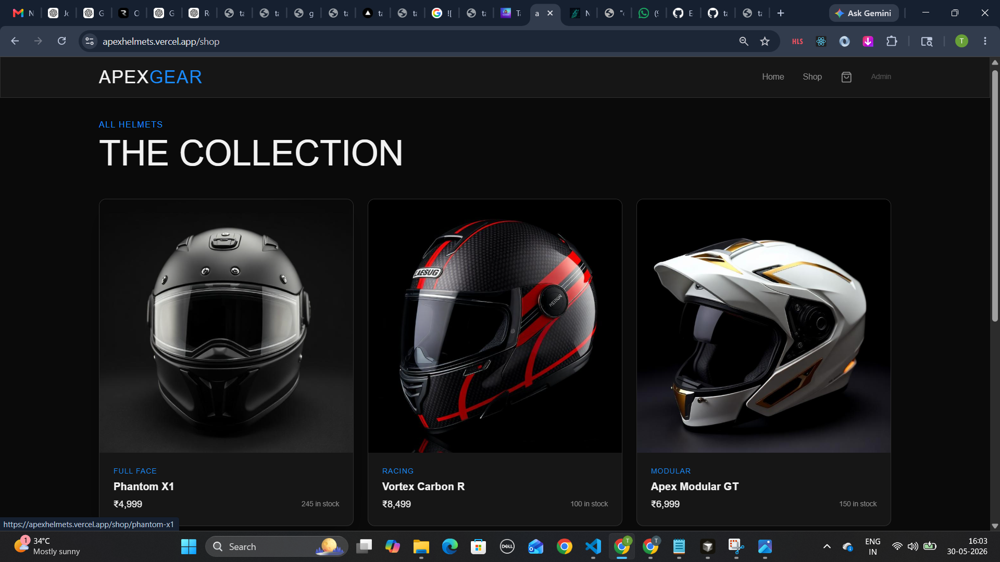
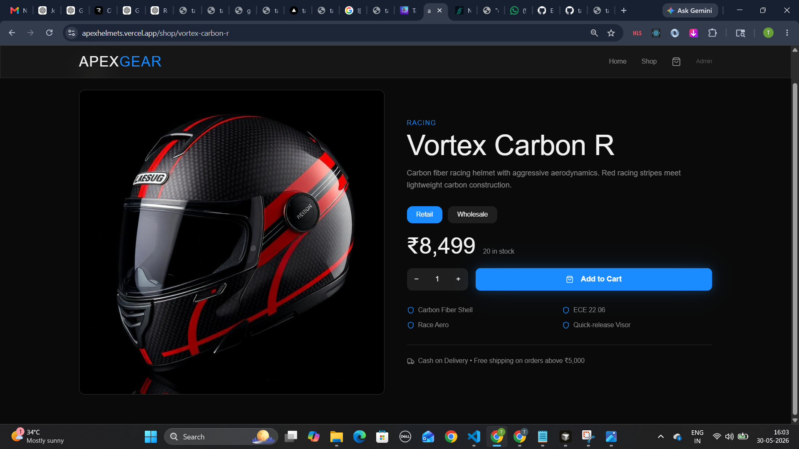
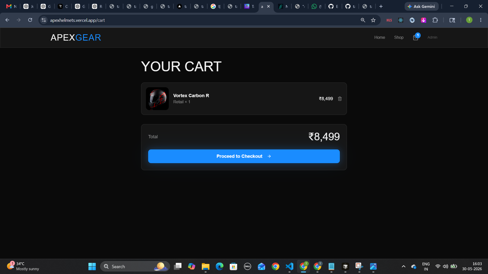
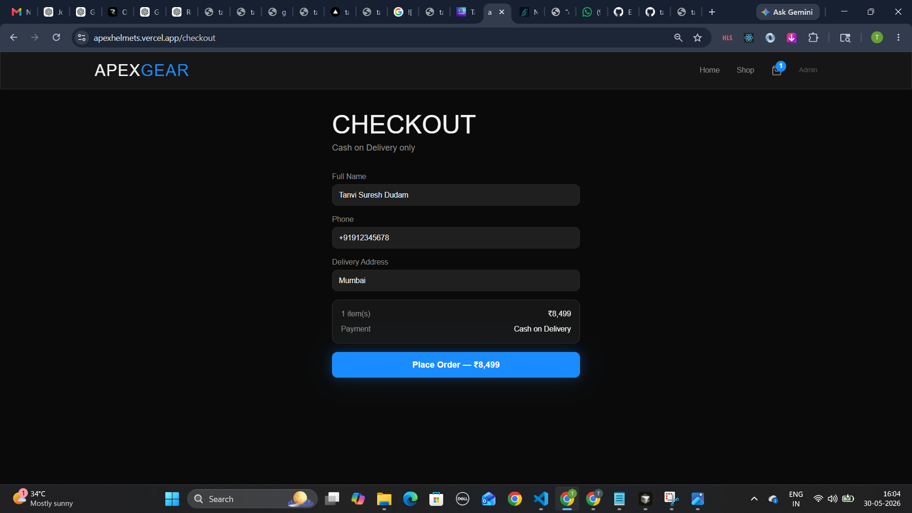
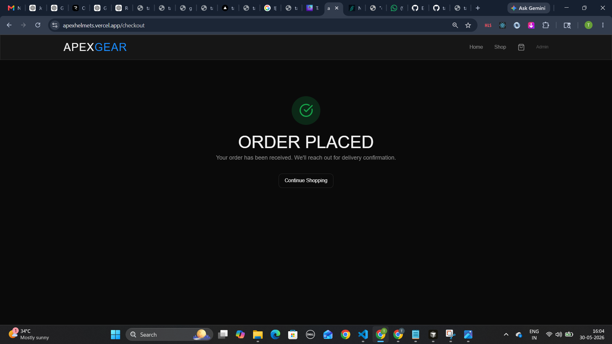
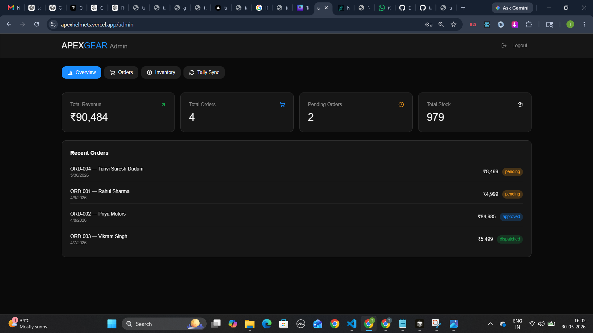

# Apex Sync Commerce

A premium helmet e-commerce platform built with React, TypeScript, Zustand, and Tailwind CSS featuring retail & wholesale purchasing, order lifecycle management, inventory tracking, and simulated TallyPrime ERP integration.

## Overview

Apex Sync Commerce is a modern e-commerce application built for premium motorcycle helmet sales. The platform supports both retail and wholesale customers, provides a complete shopping experience from product discovery to checkout, and includes an administrative dashboard for inventory, order, and sales management.

The application demonstrates a full commerce workflow while simulating ERP integration through a Tally synchronization system.

## Features

### Customer Experience

- Modern landing page with premium branding
- Product catalog with inventory tracking
- Product detail pages with specifications
- Retail and wholesale pricing modes
- Shopping cart management
- Checkout flow with order placement
- Order confirmation experience
- Responsive design for all devices

### Admin Dashboard

- Secure admin access
- Revenue and order analytics
- Inventory management
- Order approval workflow
- Dispatch management
- Tally synchronization simulation
- Stock monitoring
- Sales tracking dashboard

### Business Features

- Dual pricing model (Retail & Wholesale)
- Inventory tracking
- Order lifecycle management
- Tally ERP integration simulation
- Customer order processing
- Sales reporting

## Tech Stack

| Category | Technologies |
|-----------|-------------|
| Frontend | React 18, TypeScript |
| Build Tool | Vite |
| Routing | React Router DOM |
| Styling | Tailwind CSS |
| State Management | Zustand |
| UI Components | shadcn/ui, Radix UI |
| Icons | Lucide React |
| Forms | React Hook Form |
| Validation | Zod |
| Notifications | Sonner |
| Data Fetching | TanStack React Query |
| Testing | Vitest, Testing Library |
| Linting | ESLint |

## Architecture

```text
Customer
   │
   ▼
Storefront
   │
   ▼
Zustand Store
   │
   ├── Products
   ├── Cart
   ├── Orders
   ├── Inventory
   └── Admin State
   │
   ▼
Admin Dashboard
   │
   ▼
Tally Sync Simulation
```

### Order Flow

```text
Browse Products
      │
      ▼
Add To Cart
      │
      ▼
Checkout
      │
      ▼
Create Order
      │
      ▼
Pending
      │
      ▼
Approved
      │
      ▼
Dispatched
      │
      ▼
Tally Synced
```

## Installation

### Prerequisites

- Node.js 18+
- npm or bun

### Clone Repository

```bash
git clone <repository-url>
cd apex-sync-commerce
```

### Install Dependencies

```bash
npm install
```

or

```bash
bun install
```

### Run Development Server

```bash
npm run dev
```

Application will be available at:

```text
http://localhost:8080
```

### Build Production Version

```bash
npm run build
```

### Preview Production Build

```bash
npm run preview
```

## Project Structure

```text
apex-sync-commerce/
│
├── public/
│   ├── home.png
│   ├── shop.png
│   ├── product-details.png
│   ├── cart.png
│   ├── checkout.png
│   ├── order-success.png
│   └── admin-dashboard.png
│
├── src/
│   ├── components/
│   ├── pages/
│   ├── store/
│   ├── hooks/
│   ├── assets/
│   ├── data/
│   └── lib/
│
├── package.json
├── vite.config.ts
└── README.md
```

## Admin Access

Demo credentials:

```text
Password: admin123
```

Admin capabilities include:

- Order approval
- Order dispatch
- Inventory management
- Revenue tracking
- Tally synchronization
- Stock monitoring

## Screenshots

### Landing Page

Premium storefront homepage with featured products and branding.

.png)

---

### Product Collection

Browse all available helmet products.



---

### Product Details

Detailed product information with pricing and purchasing options.



---

### Shopping Cart

Manage products before checkout.



---

### Checkout

Customer checkout and order placement flow.



---

### Order Confirmation

Successful order placement screen.



---

### Admin Dashboard

Manage orders, inventory, revenue, and Tally synchronization.



## Future Enhancements

- User authentication
- Payment gateway integration
- Real TallyPrime API integration
- Order tracking
- Customer accounts
- Wishlist functionality
- Product reviews
- Email notifications
- Analytics dashboard
- Multi-vendor support

## License

This project is intended for learning, portfolio, and demonstration purposes.

## Author

**Tanvi Dudam**

Full Stack Developer specializing in scalable web applications, backend systems, APIs, and modern commerce solutions.
